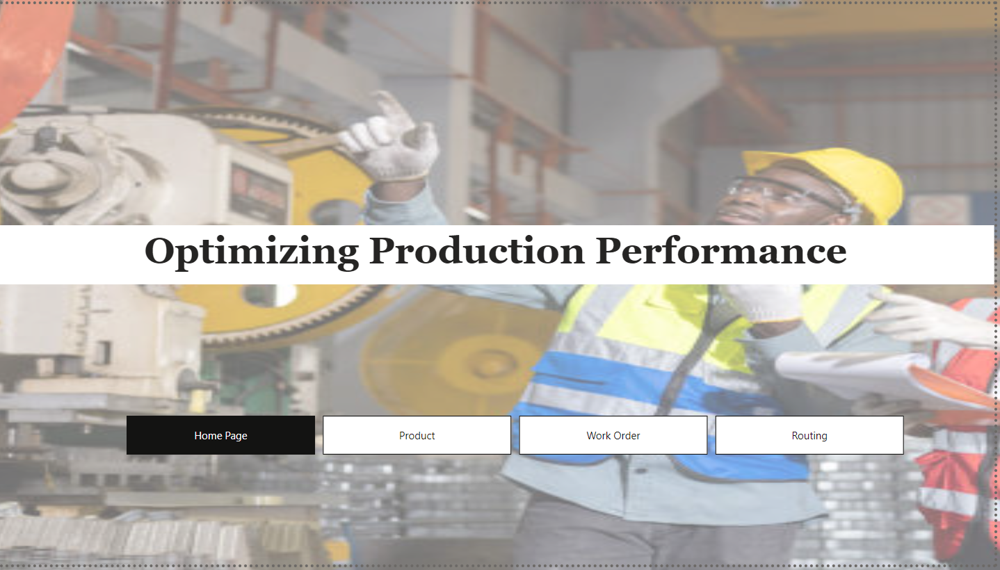
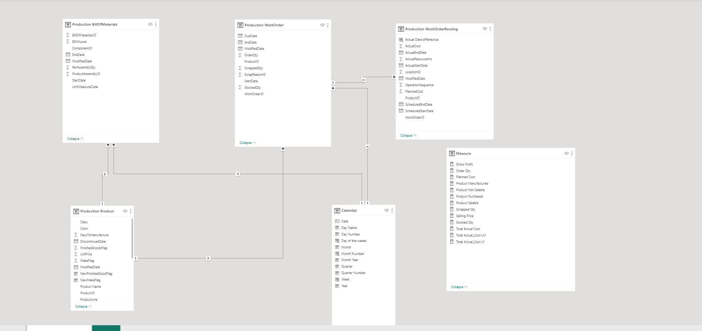
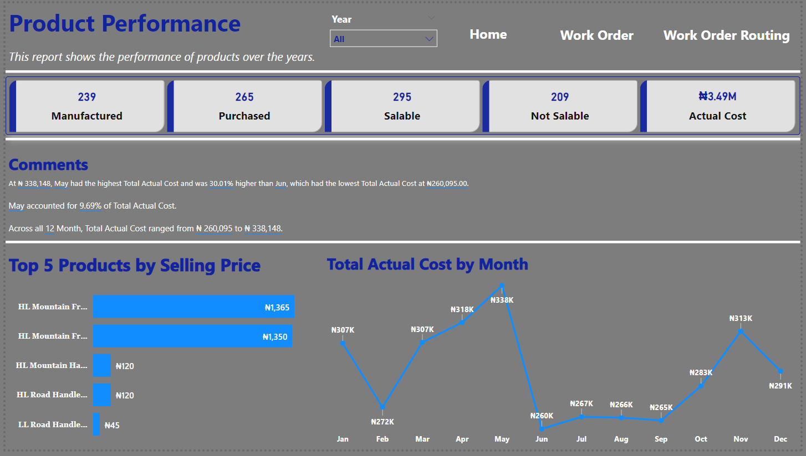
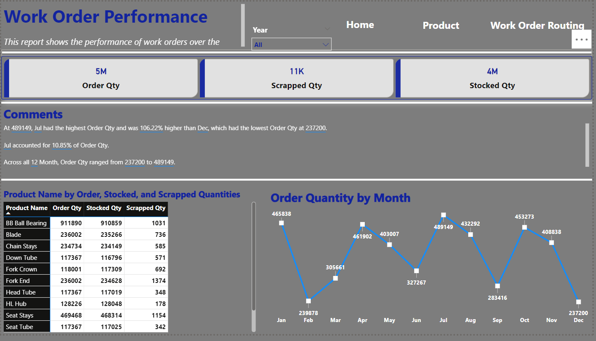
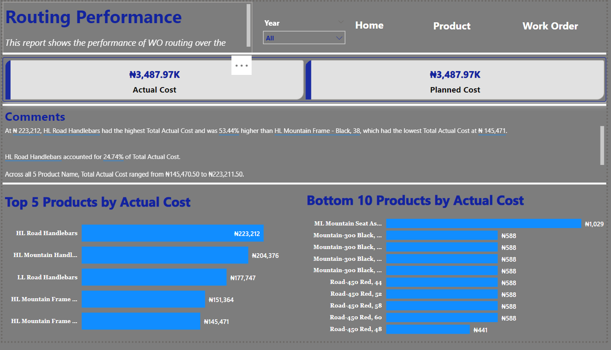

# Production-Performance-in-Manufacturing-Industry

---

## Introduction
This is a Power BI project on **Optimizing Production Performance in a Manufacturing Industry**. The project is aimed at providing valuable insights into production performance across various dimensions so that management can use it to monitor and analyze key production metrics, identify bottlenecks, and make data-driven decisions to optimize operations. I worked on this project to improve my analysis and visualization skills using Power BI.

**_Note: This project was a challenge from a community called Fabric Saturdays (formerly Power BI Saturdays) in Nigeria. The organizers provided us with the data, did the cleaning and modeling aspect of the project, I just worked on analysis and visualization aspect to provide insights that can be used to make data-driven decisions to optimize operations._**
---

## Problem Statement
For a manufacturing firm to meet customer needs, utilize resources efficiently, and increase profitability, efficient production performance is essential. In lieu to this, the project gives answers to the following questions:
- What is the total actual cost by month?
- What are the top 5 products by selling price?
- What is the total products manufactured?
- What is the total products purchased?
- What is the total products that is salable?
- What is the total products that is not salable?
- What is the total order quantity by month?
- What is the total order quantity?
- What is the total scrapped quantity?
- What is the total stocked quantity?
- What are the top 5 products by actual cost?
- What are the bottom 10 products by actual cost?
- What is the actual cost incurred over the years?
- What is the total planned cost over the years?
---

## Skill Demonstrated
The following Power BI features were used when creating the report
- Data Analysis Expression (DAX)
- Quick Measures
- Page Navigation
- Filter
- New Card Visual
- Leader Lines
- Markers.

## Data Sourcing
The data was provided by the organizers of the community meetups (Fabric Saturdays) but was gotten from AdventureWorks2019 database tables - Production.Product, Production.BillOfMaterials, Production.WorkOrder, and Production.WorkOrderRouting.

## Data Modeling

The data was also modeled by the organizers of the community meetups (Fabric Saturdays). The table that was not connected was the DAX measures I created. I created a table for it so I can have everything in a place and to structure my report well.

## Data Analysis and Visualization
The report comprises four pages:
- Home
- Product 
- Work Order
- Work Order Routing

### Home

This has four-page navigations in it. When you click on each of them, it takes you directly to the page.

### Product

The following were the insights gotten from product page and it answered the question 1-6 we have under the problem statement.
- 239 products were manufactured.
- 265 products were purchased to manufacture their products.
- 295 products were salable.
- 209 products were not salable because they were purchased to manufacture their main products. 
- HL Mountain Frame – Silver, 46 has the highest selling price.
- In 2013, the company incurred the highest actual cost of over 1.5millions naira in producing their products, in which the month of November had the highest cost and February had the lowest cost. In 2011, the company incurred the lowest actual cost of over 342thousands naira in producing their products, in which the month of December had the highest cost and June had the lowest cost.

### Work Order

The following were the insights gotten from work order page and it answered the question 7-10 we have under the problem statement.
- Over 5millions quantities were ordered.
- Over 11thousands quantities were scrapped because they failed inspection during the manufacturing process.
- Over 4millions quantities were stocked and this was calculated by subtracting the scrapped quantities from the ordered quantities. 
- July had the highest order quantities while December had the lowest.

### Work Order Routing

The following were the insights gotten from work order page and it answered the question 11-14 we have under the problem statement.
- Over the years, over 223thousands was incurred in producing HL Road Handlebars product which had the highest actual cost.
- Road-450 Red, 48 had the lowest actual cost incurred in producing it.

## Conclusion
- The company did well in meeting their customers’ needs because they were able to produce over 4million quantities out of 5millions quantities ordered but they can do better.
- The scrap quantities were much as this increased the actual cost incurred in producing all their products.
- They didn’t exceed their planned cost of 3.5millions as this was the same with the actual cost incurred in producing the products.

## Recommendation
- Adequate inspection should be done at the right time to reduce the scrap quantities during the production process.

_**To interact with the report, click [here](https://app.powerbi.com/groups/me/reports/6695474d-a321-4914-b654-0b3a69243d10?ctid=7bb04057-9724-4194-9478-a76b704c6dc9&pbi_source=linkShare).**_

**Thanks for staying through 🙇**

